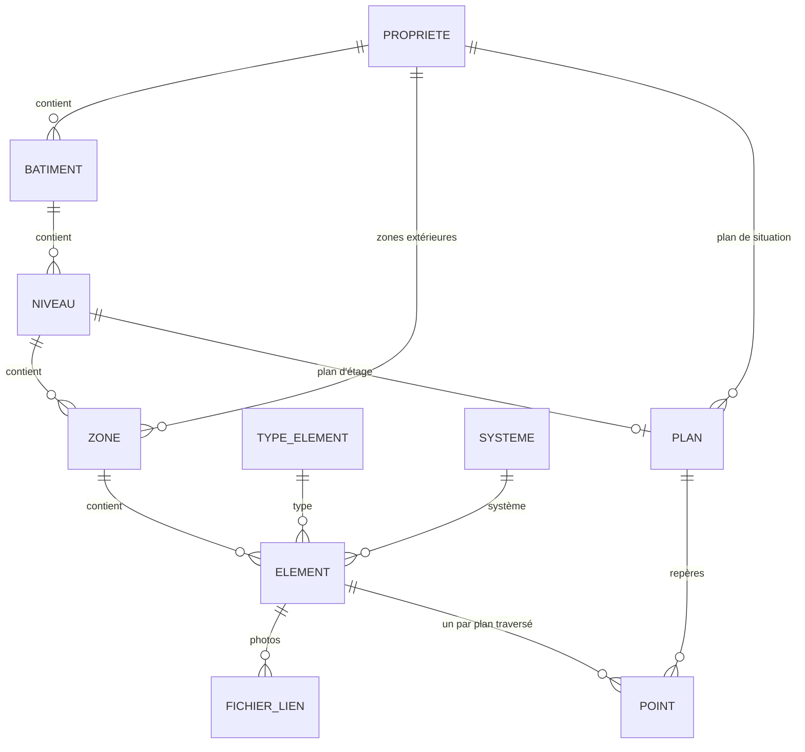
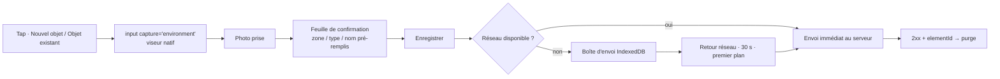
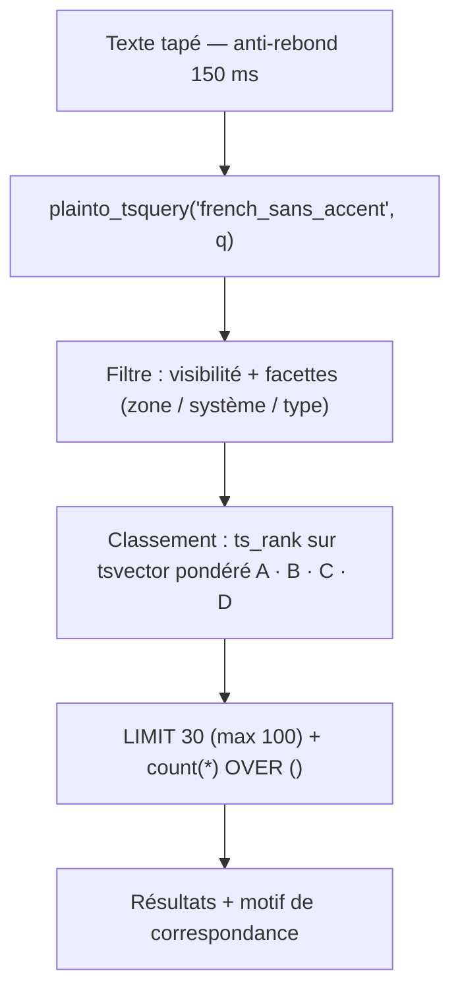

<a name="top"></a>

<div align="center">


<br/>

[](https://github.com/theo-bggtt/gestionImmobiliere)

<br/>


</div>

<br/>

> Mémoire technique d'un bien immobilier. L'étape 0 a posé les fondations (schéma complet, authentification, catalogue de types, CRUD avec formulaire dynamique), l'étape 1 la capture opportuniste (photo d'abord, hors ligne, boîte d'envoi), l'étape 2 la recherche plein texte classée et les facettes, l'étape 3 la **projection** de la même base selon qui la regarde — un lien de partage donne à voir une partie du bien, à un plafond de visibilité et sur une portée de zones ou de systèmes, sans compte et sans installation. Cette étape ajoute la deuxième entrée pour retrouver un objet : le **plan**. Le propriétaire téléverse le plan de chaque niveau, y pose des points, et un point mène à une fiche — y compris au bout d'un lien de partage, où le plan est servi sans une ligne de JavaScript. Pas de chronologie, pas de tracé de zones — voir [`.decisions/implementation-plan.md`](.decisions/implementation-plan.md) pour la suite.

<br/>

## Sommaire

<table>
<tr>
<td valign="top" width="50%">

**Démarrer**
- [Prérequis](#prérequis)
- [Démarrage (Docker)](#démarrage-docker)
- [Démarrage (développement local)](#démarrage-développement-local-hors-docker-pour-lapp)
- [Migrations](#migrations)
- [Charger les données](#charger-les-données)
- [Tests](#tests)
- [Modèle de données](#modèle-de-données)

</td>
<td valign="top" width="50%">

**Comprendre**
- [La capture](#la-capture)
- [Retrouver](#retrouver)
- [Partager](#partager)
- [Le plan](#le-plan)
- [Revue de fuite](#revue-de-fuite)
- [Structure des dossiers](#structure-des-dossiers)
- [Décisions prises](#décisions-prises-non-spécifiées-par-le-prompt-détape)
- [Limites connues](#limites-connues)

</td>
</tr>
</table>

---

## Prérequis

- Docker et Docker Compose
- Node.js 22+ (pour le développement hors conteneur)
- npm

## Démarrage (Docker)

```bash
cp .env.example .env
# éditer .env : POSTGRES_PASSWORD et SESSION_SECRET
docker compose up
```

L'application applique ses migrations automatiquement au démarrage (`scripts/migrate.mjs`) et écoute sur `http://localhost:3000`. Les photos sont écrites dans le volume `fichiers_data`, monté sur `/donnees`. La base est vide : voir [Charger les données](#charger-les-données) ci-dessous.

## Démarrage (développement local, hors Docker pour l'app)

```bash
cp .env.example .env
docker compose up -d postgres
npm install
npm run db:migrate
npm run dev
```

Le service worker n'est enregistré qu'en production (Vite sert des centaines de modules non versionnés en développement). Pour éprouver le hors ligne, il faut donc un build :

```bash
npm run build
NODE_ENV=production node --env-file=.env server/app.js
```

## Migrations

- `npm run db:generate` — génère une migration à partir du schéma Drizzle (`app/db/schema/`), après l'avoir modifié. Migrations versionnées dans `drizzle/`.
- `npm run db:migrate` — applique les migrations en attente (utilisé aussi bien en dev qu'en prod, via `scripts/migrate.mjs`).

## Charger les données

```bash
npm run seed:catalogue   # 33 types système avec alias — idempotent, rafraîchit les alias
npm run seed:exemple     # propriété "Maison d'exemple" complète — idempotent
```

Identifiants de démonstration créés par `seed:exemple` : `demo@gestion-immobiliere.local` / `demo1234`. **Jetables : à ne jamais utiliser en production.**

## Tests

```bash
docker compose exec postgres createdb -U gestion gestion_immobiliere_test   # une fois
cp .env.test.example .env.test
set -a && source .env.test && set +a && npx tsx scripts/seed-catalogue.ts    # une fois, requis par les tests d'alias et de recherche
npm test
```

<p align="right"><a href="#top">↑ haut de page</a></p>

---

## Modèle de données



`niveau.ordinal` est un entier signé (sous-sol -2, rez 0, etc.) : c'est la clé de tri, `niveau.nom` n'est qu'un libellé libre. `zone.niveauId` n'est nul que pour les zones extérieures, rattachées directement à la propriété — l'extérieur est une zone comme une autre, jamais un cas particulier dans l'interface.

<p align="right"><a href="#top">↑ haut de page</a></p>

---

## La capture

### Le flux

Deux déclencheurs vivent dans une barre fixée en bas de **tous** les écrans authentifiés, y compris l'écran d'accueil : ils sont donc toujours à un geste.

- **Nouvel objet** (cas A) — l'objet n'existe pas encore.
- **Objet existant** (cas B) — l'entretien : je viens de changer le filtre, je documente. Aussi accessible depuis la fiche, où l'objet est alors déjà connu.

Chaque déclencheur est un `<label>` qui porte un `<input type="file" accept="image/*" capture="environment">` : **le viseur s'ouvre sur le geste lui-même**, sans navigation ni JavaScript intermédiaire. C'est la seule façon fiable sur Safari iOS, où un `click()` programmatique après un changement de route est bloqué faute de geste utilisateur.



La photo prise, une feuille de confirmation se superpose à l'écran courant — toujours pas de navigation, pour ne pas perdre le `File` ni payer un aller-retour serveur qu'on n'a pas à la cave :

1. **Zone**, pré-remplie par la dernière zone utilisée (mémorisée localement ; à défaut, la zone la plus récemment capturée d'après l'instantané serveur).
2. **Type**, pré-rempli par le type le plus posé dans cette zone ; à défaut le type le plus récemment utilisé. Changer la zone re-propose le type, tant que l'utilisateur n'en a pas choisi un lui-même.
3. **Nom** généré (« Prise 230V — Chambre 2 »), affiché sous les deux lignes, modifiable d'un tap. Jamais à saisir.
4. **Enregistrer**.

Les deux sélecteurs s'ouvrent en plein écran, récent en tête, avec un champ de filtre qui cherche aussi dans les alias du catalogue — **jamais autofocus** : faire surgir le clavier coûterait une seconde à qui accepte les valeurs proposées.

**Aucun champ du type n'est demandé.** La fiche est créée avec `details` vide et `niveau = 3` (privé). Les caractéristiques se remplissent plus tard, à tête reposée, par le formulaire dynamique de l'étape 0.

### Chronométrage

<details>
<summary><strong>Ce qui a été mesuré</strong></summary>
<br/>

Build de production, Chromium piloté, viewport 414×896, **mode avion réel** (réseau coupé au niveau du navigateur, pas seulement le serveur arrêté), catalogue et arborescence de la propriété d'exemple. Photos sources : 4000×3000, orientation EXIF 6, 3,9 à 5,5 Mo.

| # | Scénario | Rendu de la feuille | Enregistrement | **Part applicative** | Gestes après la photo | Clavier |
|---|---|---|---|---|---|---|
| 1 | valeurs proposées acceptées | 1 ms | 182 ms | **183 ms** | 1 | non |
| 2 | zone changée (Chambre 2 → Cuisine) | 1 ms | 12 ms | **13 ms** | 3 | non |
| 3 | valeurs proposées acceptées | 1 ms | 164 ms | **165 ms** | 1 | non |

*Rendu de la feuille* = de l'arrivée de la photo à l'affichage de l'aperçu. *Enregistrement* = du tap sur « Enregistrer » à la confirmation à l'écran, écriture dans la boîte d'envoi comprise.

Compression mesurée à part : **132 à 137 ms** pour une 4000×3000 sur cette machine. Elle démarre à l'instant où la photo arrive et tourne pendant que la feuille est à l'écran, donc hors du chemin critique. Sur un téléphone, compter 4 à 8 fois plus, soit 0,5 à 1,1 s — toujours terminé avant que le doigt n'atteigne « Enregistrer ».

</details>

<details>
<summary><strong>Ce qui n'a PAS été mesuré, et pourquoi</strong></summary>
<br/>

**Aucune de ces trois captures n'a été faite sur un vrai téléphone avec un vrai appareil photo.** Le pilotage automatique remplace `<input capture>` par un fichier local, ce qui court-circuite précisément l'étape la plus longue : ouverture de l'appareil photo natif, cadrage, déclenchement, retour à l'application. Le temps de réaction humain entre deux taps n'est pas mesuré non plus.

Autrement dit, les chiffres ci-dessus disent ce que coûte le **logiciel**, pas ce que coûte la **capture**.

</details>

<details>
<summary><strong>Le reste du budget, annoncé comme un budget</strong></summary>
<br/>

| Poste | Secondes | Origine |
|---|---|---|
| Tap sur « Nouvel objet » | 1,0 | estimation |
| Ouverture de l'appareil photo natif | 1,0 – 2,0 | estimation |
| Cadrage et déclenchement | 3,0 – 6,0 | estimation |
| Retour à l'app, aperçu affiché | 0,5 | mesuré côté app (1 ms) + estimation OS |
| Lecture de la feuille, décision | 2,0 – 3,0 | estimation |
| *(si la zone change : 2 taps + parcours de la liste)* | *+3,0 – 5,0* | estimation |
| Tap sur « Enregistrer » | 1,0 | estimation |
| Écriture et confirmation | 0,2 | **mesuré** |
| **Total, valeurs acceptées** | **8,7 – 13,7** | |
| **Total, zone changée** | **11,7 – 18,7** | |

</details>

**Verdict.** La part logicielle du chronomètre est de **0,2 seconde**. Elle ne peut pas, dans son état actuel, faire échouer le critère des 30 secondes : il resterait 29,8 s au geste humain et à l'appareil photo, soit deux fois le budget estimé le plus pessimiste. Le nombre de gestes après la photo — **un seul** quand les valeurs proposées conviennent, trois quand on change de zone — est le vrai levier, et il est au plancher.

**Mais le critère demande trois captures réelles, et elles restent à faire.** Le tableau ci-dessous est à remplir sur un téléphone, chronomètre en main, avant de considérer l'étape close. Si l'une dépasse 30 secondes, c'est le flux qu'il faut retravailler, pas la mesure.

| # | Zone | Type | Valeurs acceptées ? | Secondes | Appareil / navigateur |
|---|---|---|---|---|---|
| 1 | | | | *à remplir* | |
| 2 | | | | *à remplir* | |
| 3 | | | | *à remplir* | |

### La boîte d'envoi

Éphémère, jamais un stockage. Une entrée n'y vit qu'entre la capture et l'accusé de réception du serveur.

**Compression avant écriture.** `createImageBitmap(fichier, { imageOrientation: "from-image" })` pivote les pixels d'après l'EXIF, le canvas ré-encode à 2000 px sur le grand côté en JPEG qualité 0,8, et n'écrit aucune métadonnée. Ce qui entre dans IndexedDB est donc déjà droit et déjà nettoyé. Mesuré : **une photo de 4 114 035 octets (3,92 Mo) occupe 443 919 octets (434 Ko)** dans la file, en 1500×2000. Sur une image de bruit pur (pire cas, 5,05 Mo), 611 Ko.

**Déclencheurs d'envoi**, dans cet ordre de préférence :

1. immédiatement après chaque capture ;
2. au retour au premier plan (`visibilitychange`) ;
3. à l'évènement `online` ;
4. **toutes les 30 s tant que la file n'est pas vide.**

Le quatrième n'était pas prévu. Il a été ajouté après avoir mesuré que `navigator.onLine` peut rester à `true` alors que tout `fetch` échoue : dans ce cas l'évènement `online` ne part jamais au retour du réseau, et une file pleine attendrait indéfiniment. `navigator.onLine` sert donc à déclencher, jamais à décider. Il n'y a de toute façon pas de Background Sync sur iOS.

**Purge** dès l'accusé de réception du serveur, pas plus tard.

**Une capture n'est jamais perdue en silence.** Une entrée ne quitte la file que sur un **2xx portant un identifiant de fiche** — le seul accusé de réception qui prouve que la capture est en base. Tout le reste la laisse intacte :

| Réponse | Entrée | Tentative comptée | Suite |
|---|---|---|---|
| 2xx avec `elementId` | **purgée** | — | fiche en base, lien « compléter » actif |
| 2xx sans `elementId` (page HTML d'un proxy) | gardée | oui | retentée |
| Redirection vers `/connexion`, 401, 403 | gardée | **non** | « Session expirée » ; repart seule après reconnexion |
| 400, 413, 422 | gardée | définitive | erreur visible : la même requête ne passera jamais |
| **tout le reste** (409, 429, 500, 502, code inattendu…) | gardée | oui | retentée |
| `fetch` qui lève (pas de connexion) | gardée | **non** | retentée au prochain déclencheur |

**Le défaut est « réessayable ».** Seuls trois statuts arrêtent les frais — `STATUTS_DEFINITIFS` dans `synchro.ts` — et tout code absent de cette liste, y compris ceux qu'on n'a pas anticipés, consomme une tentative mais reste réessayable. Les deux erreurs de classement ne coûtent pas la même chose : garder à tort une capture réessayable coûte cinq envois pour rien, la déclarer à tort définitive immobilise une capture que personne n'a vue passer.

Les deux « non » de la colonne comptent aussi. Un `fetch` qui lève n'est pas une tentative ratée mais une tentative qui n'a pas eu lieu : la compter suffirait à faire crier au loup après trois captures dans une cave. Une session expirée se répare en se reconnectant, pas en réémettant la requête : brûler des tentatives obligerait l'utilisateur à retrouver un bouton « Réessayer » alors que la file serait déjà repartie toute seule.

Au bout de 5 tentatives, l'entrée bascule en erreur visible avec son message et un bouton « Réessayer » qui remet le compteur à zéro. Tant que la file n'est pas vide, un indicateur « n en attente » reste dans l'en-tête, avec un envoi forçable.

**Doublons.** Le client fabrique un `captureId` avant d'écrire dans la file ; il est stocké en `fichier.capture_id` sous index unique. Un réseau mobile qui coupe après l'écriture serveur mais avant la réponse fait rejouer l'envoi : le serveur reconnaît la capture et renvoie la fiche existante au lieu d'en créer une seconde.

### Traitement des images côté serveur

Le client a beau envoyer une image déjà propre, on ne fait pas confiance à ce qui arrive du réseau : le serveur refait le travail.

`sharp(...).rotate()` applique l'orientation EXIF, puis le ré-encodage n'écrit aucune métadonnée — **l'ordre est garanti par la bibliothèque**, effacer avant de pivoter serait impossible ici. Un original à 2000 px et une vignette à 400 px sont écrits derrière l'interface de stockage (`sauvegarder`, `lire`, `supprimer`, `cheminVignette` dans `app/lib/stockage/`) : un passage à S3 plus tard ne touchera que ce fichier. `fichier.exif_efface` est mis à `true`.

Vérifié sur les octets, pas à l'œil (`tests/images/traitement.test.ts`) : ni segment APP1 (`0xFFE1`), ni chaîne `Exif\0\0`, ni marque de l'appareil, et une source 1200×800 en orientation 6 ressort en 800×1200.

Les images ne sont jamais servies par un chemin public devinable : `GET /proprietes/:proprieteId/fichiers/:fichierId` (`?taille=vignette`), scopée propriété comme le reste de `_app`.

### PWA et hors ligne

Manifeste, icônes (dont une *maskable*), `display: standalone`, `start_url: "/"`.

Le service worker (`public/sw.js`) tient en trente lignes : documents en réseau-d'abord avec repli sur le cache, actifs `/assets/` en cache-d'abord. Il ne met **pas** en cache les images ni les données de capture — les premières sont privées, les secondes ont déjà leur copie dans IndexedDB.

Un piège à connaître : **React Router navigue en SPA**, donc après la connexion plus aucune requête de document n'est émise et le service worker ne voit jamais passer la coquille qu'il est censé garder. C'est la page qui l'amorce elle-même (`app/lib/capture/coquille.ts`) : elle met `/` en cache et y ajoute les actifs que la page vient réellement de charger, relevés dans `performance.getEntriesByType("resource")` — pas de manifeste de build à tenir à jour.

Vérifié : réseau coupé au niveau du navigateur, l'app démarre depuis le cache, mise en page comprise ; trois captures d'affilée sont mises en file ; réseau rétabli **sans aucune action utilisateur**, la file se vide et les fiches sont en base.

**iOS n'a pas d'invite d'installation** ni de `beforeinstallprompt`. Une aide « Partager → Sur l'écran d'accueil » s'affiche une fois, sur Safari iOS uniquement, quand l'app n'est pas déjà installée.

### Sur la fiche

L'écran d'une fiche montre ses photos, la plus récente en premier, et un bouton « Ajouter une photo » qui relance le flux pré-lié à cet objet. Une capture partie pendant que la fiche est ouverte y apparaît toute seule.

<p align="right"><a href="#top">↑ haut de page</a></p>

---

## Retrouver

### Ce qu'il a fallu corriger avant d'exposer quoi que ce soit

Le plan annonçait la mécanique de recherche comme livrée à l'étape 0. Elle l'était à 80 % — déclencheur, index GIN, alias, catalogue — mais deux critères d'acceptation de cette étape étaient **infaisables** en l'état. Les deux sont mesurés, pas supposés, et corrigés par la migration `0005_recherche_poids_accents.sql`.

**1. La configuration `french` ne dépouille pas les accents.**

```
to_tsvector('french', 'Éclairage')      -> 'éclairag'
plainto_tsquery('french', 'eclairage')  -> 'eclairag'      -- aucune correspondance
```

Le stemmer gère les pluriels, pas les diacritiques. Taper sans accent, ce que fait tout le monde sur un clavier de téléphone, ne remontait rien. La migration crée `french_sans_accent`, copie de `french` avec le dictionnaire `unaccent` en tête de chaîne :

```sql
CREATE EXTENSION IF NOT EXISTS unaccent;
CREATE TEXT SEARCH CONFIGURATION french_sans_accent (COPY = french);
ALTER TEXT SEARCH CONFIGURATION french_sans_accent
  ALTER MAPPING FOR hword, hword_part, word WITH unaccent, french_stem;
```

**2. Un `tsvector` sans poids ne peut pas classer.** Le déclencheur de l'étape 0 concaténait nom, alias, type, zone, système et détails dans un seul vecteur non pondéré. `ts_rank` ne regarde ni la position ni la provenance : à fréquence égale, une correspondance sur le nom et une correspondance sur les détails rendaient **exactement le même rang**. Le déclencheur pose désormais les quatre poids de PostgreSQL :

| Poids | Source | Coefficient `ts_rank` par défaut |
|---|---|---|
| A | nom de la fiche | 1,0 |
| B | alias de la fiche, nom et alias du type | 0,4 |
| C | nom de la zone, nom du système | 0,2 |
| D | valeurs des `details` | 0,1 |

L'opérateur `@@` ignore les poids : aucune requête existante ne change de résultat, seul le classement bouge. La migration recalcule les lignes déjà en base par un `UPDATE element SET recherche = recherche`, qui les repasse par le déclencheur — même mécanique qu'en 0003.

Vérifié sur le jeu d'exemple : `robinet` rend `Robinet évier` à 0,669 et `Vanne d'arrêt générale` (alias) à 0,243.

### La requête



Une seule requête SQL, dans `app/lib/recherche/recherche.server.ts`. Elle est écrite à la main : elle mêle `tsvector` pondéré, `ts_rank`, un `LATERAL` pour la vignette et un `count` fenêtré, là où le constructeur de Drizzle n'apporterait que du bruit.

```sql
WITH q AS (
  SELECT plainto_tsquery('french_sans_accent', :q) AS tsq,
         replace(plainto_tsquery('french_sans_accent', :q)::text, ' & ', ' | ')::tsquery AS tsq_ou
)
SELECT e.id, e.nom, z.nom, b.nom, n.nom, t.nom, s.nom, ph.id,
       (count(*) OVER ())::int AS total,
       CASE ... END AS motif                      -- voir « le motif » ci-dessous
FROM element e CROSS JOIN q
JOIN zone z ON z.id = e.zone_id
JOIN type_element t ON t.id = e.type_id
LEFT JOIN niveau n ON n.id = z.niveau_id
LEFT JOIN batiment b ON b.id = n.batiment_id
LEFT JOIN systeme s ON s.id = e.systeme_id
LEFT JOIN LATERAL (                               -- la photo la plus récente
  SELECT f.id FROM fichier_lien fl JOIN fichier f ON f.id = fl.fichier_id
  WHERE fl.cible_type = 'element' AND fl.cible_id = e.id
  ORDER BY f.date_prise DESC NULLS LAST, f.id DESC LIMIT 1
) ph ON true
WHERE e.propriete_id = :proprieteId
  -- Filtre de visibilité, écrit dès maintenant, inerte aujourd'hui.
  AND e.niveau <= :niveauMax
  AND (:porteeVide OR e.zone_id = ANY(:zones) OR e.systeme_id = ANY(:systemes))
  -- Les facettes restreignent, le texte classe.
  AND (:texteVide OR e.recherche @@ q.tsq)
  AND (:zonesVide    OR e.zone_id    = ANY(:facetteZones))
  AND (:systemesVide OR e.systeme_id = ANY(:facetteSystemes))
  AND (:typesVide    OR e.type_id    = ANY(:facetteTypes))
ORDER BY ts_rank(e.recherche, q.tsq) DESC, e.nom ASC
LIMIT :limite OFFSET :decalage
```

**Le filtre de visibilité est déjà là**, sous la forme exacte que l'étape 3 branchera. Le propriétaire passe `PORTEE_PROPRIETAIRE` (`niveauMax: 3`, portées nulles) ; un lien de partage passera son niveau et sa portée, et ni la requête ni ses tests ne changeront. Il s'applique aussi à `chargerFacettes` et à `chargerZonesVignettes` — une portée qui masquerait des fiches mais laisserait leur compte s'afficher dans la grille de zones serait une fuite (règle non négociable #4 du plan : le filtre est dans la requête, jamais un écran « accès refusé »).

**Le total** vient de `count(*) OVER ()`, donc d'un seul aller-retour. La contrepartie assumée : PostgreSQL matérialise toutes les lignes du filtre avant d'appliquer `LIMIT`. À 5 000 fiches, mesuré, ça ne se voit pas.

**La limite** est franche : 30 résultats par défaut, 100 au maximum. `decalage` existe côté serveur, l'interface ne l'expose pas encore — le compte total suffit à dire « 31 résultats, 30 affichés ».

### Le motif de correspondance

L'étiquette discrète à droite de chaque résultat (`nom`, `alias`, `type`, `zone`, `système`, `détails`) est un `CASE` qui teste les champs sources **un par un**, dans cet ordre, et retient le premier qui correspond :

```sql
CASE
  WHEN to_tsvector(cfg, e.nom) @@ q.tsq_ou THEN 'nom'
  WHEN to_tsvector(cfg, concat_ws(' ', e.alias, t.alias)) @@ q.tsq_ou THEN 'alias'
  WHEN to_tsvector(cfg, t.nom) @@ q.tsq_ou THEN 'type'
  WHEN to_tsvector(cfg, z.nom) @@ q.tsq_ou THEN 'zone'
  WHEN to_tsvector(cfg, s.nom) @@ q.tsq_ou THEN 'systeme'
  WHEN to_tsvector(cfg, <valeurs des details>) @@ q.tsq_ou THEN 'details'
END
```

Deux points méritent l'explication.

**Le `CASE` n'est évalué que sur les lignes retenues.** PostgreSQL calcule la liste de sélection après le filtre : ces six `to_tsvector` tournent sur les résultats, pas sur la table.

**`tsq_ou` n'est pas `tsq`.** `plainto_tsquery` relie les termes par un ET : sur « vanne cuisine », la fiche entière correspond (vanne vient du type, cuisine de la zone) alors qu'**aucun champ pris isolément** ne correspond — l'étiquette serait vide. `tsq_ou` est la même requête avec ses `&` remplacés par des `|`. Dériver la variante du texte de la requête déjà produite par PostgreSQL évite d'assainir la saisie soi-même : ce qui sort de `plainto_tsquery` est par construction une `tsquery` valide.

Le prompt d'étape l'annonce : ce calcul « n'a pas besoin d'être exact, il doit être utile ». C'est ce qu'il est. Une fiche nommée « Robinet » de type « Robinet » est étiquetée `nom`, ce qui est vrai sans être toute la vérité.

### Temps mesurés

Build de production, PostgreSQL 16 en conteneur local, propriété d'exemple (31 fiches, 13 zones, 33 types, 95 alias). `ms` est la durée passée en base, mesurée par la requête elle-même et renvoyée dans la réponse JSON ; `http` est le temps total de bout en bout vu par le client.

| Requête | Résultats | En base | HTTP total |
|---|---|---|---|
| `robinet` | 3 | 2,9 ms | 9 ms |
| `vannes` | 2 | 2,2 ms | 7 ms |
| `eclairage` | 1 | 2,6 ms | 8 ms |
| `compteur` | 2 | 2,5 ms | 8 ms |
| `prise cuisine` | 1 | 4,2 ms | 11 ms |
| *(vide, tout le fonds)* | 31 | 3,8 ms | 8 ms |

Le budget de l'étape est de 150 ms. On en consomme moins de 5 en base.

**À 5 000 fiches** (jeu de charge injecté puis retiré), la même requête tient **28 à 36 ms** sur le mot le plus fréquent, 4 ms sur un mot rare. La marge reste d'un facteur quatre. Un test d'intégration (`tests/recherche/requete.test.ts`) verrouille le seuil à 200 fiches ; si un jour il tombe, c'est un index qui manque, pas un cache à ajouter.

### L'écran de recherche

`/proprietes/:id/recherche`. **Son URL est son état** : `?q=robinet&zone=3&systeme=2`. Un résultat se partage, se met en favori, et le retour arrière fonctionne. Conséquence assumée : les données viennent du loader, pas d'un fetcher — une seule source, pas deux vues à réconcilier.

Le champ reste piloté localement pour rester fluide sous le doigt ; c'est la valeur **anti-rebondie à 150 ms** qui part dans l'URL, en `replace` pour que trente frappes ne remplissent pas l'historique.

Les résultats précédents restent affichés, estompés, pendant le chargement du suivant : rien ne clignote entre deux frappes.

**État vide.** Quand rien ne correspond, la page ne se contente pas de le dire : elle cherche dans le catalogue les types qui portent ce mot et les affiche avec leurs alias. « lave-linge » sur le jeu d'exemple ne remonte aucune fiche mais annonce que *Lave-linge* et *Lave-vaisselle* existent au catalogue et qu'aucun objet de ces types n'est encore enregistré, puis propose « Ajouter un objet ». Deux filets sont tendus : la correspondance plein texte (qui gère accents et pluriels), puis une sous-chaîne sans accent, qui rattrape les saisies partielles — « robi » ne produit aucun lexème utile mais désigne bien « robinet ».

### Les facettes

Trois dimensions — **système**, **zone**, **type** — en pastilles cumulables, sur l'écran de recherche lui-même et non derrière un écran séparé.

**OU à l'intérieur d'une dimension, ET entre dimensions.** Cocher *Cuisine* et *Jardin* rend les objets de l'une ou l'autre ; y ajouter *Sanitaire* rend ceux qui sont dans l'une de ces zones **et** de ce système.

Elles se combinent au texte selon la règle du prompt : **les facettes restreignent, le texte classe.** Sans texte, les facettes seules listent la sélection, triée par nom.

**Le compte porté par une pastille est celui du fonds, pas du résultat courant.** Les facettes proposées décrivent la propriété entière (sous filtre de visibilité) et ne bougent pas quand on tape : une pastille qui disparaîtrait dès la première lettre ne se décocherait plus. C'est le compte de résultats, au-dessus de la liste, qui suit la recherche. Une dimension qui dépasse huit valeurs se replie derrière « + n autres » ; une pastille cochée reste toujours visible, pour la même raison.

### L'écran d'accueil

Dans cet ordre vertical :

1. **Le champ de recherche**, épinglé en haut (`position: sticky`) : il ne sort jamais du champ de vision.
2. **La grille de zones**, deux colonnes (trois au-delà de 560 px), vignette carrée, nom et nombre d'objets en surimpression.

Le champ **ne navigue pas**. Il interroge la route de ressource `recherche/donnees` et remplace la grille par ses résultats tant qu'on tape ; effacer la ramène. Naviguer coûterait un chargement et ferait disparaître la grille pour un mot qu'on efface trois secondes plus tard. Un lien « Affiner avec les filtres » mène à l'écran de recherche en emportant la requête, pour qui veut les facettes.

**L'image d'une zone est la photo la plus récente rattachée à un élément de cette zone** — jointure réelle par `fichier_lien → element → zone`, et non la colonne dénormalisée `fichier.zone_id`, qui divergerait si l'objet changeait de zone. À défaut de photo : un aplat neutre à l'initiale, jamais une image cassée ni une case vide. Le voile sombre qui porte le texte n'est posé que sur les photos — sur un aplat il n'a rien à combattre et ne ferait que salir la case.

Zones intérieures et extérieures dans la même grille, les extérieures en fin de liste (`ORDER BY (z.niveau_id IS NULL), b.ordre, n.ordinal, z.ordre, z.nom`). Une zone sans objet reste affichée avec « 0 objet » : c'est une information, pas un trou.

Une case de zone mène à `recherche?zone=<id>`, c'est-à-dire à l'écran qui sait déjà lister, filtrer et compter.

**La capture n'a pas bougé.** Les deux déclencheurs vivent dans le layout (étape 1, décision #18), en barre fixe : ils restent à un tap depuis l'accueil comme depuis n'importe quel écran, y compris pendant qu'on tape dans le champ de recherche.

<p align="right"><a href="#top">↑ haut de page</a></p>

---

## Partager

Le propriétaire crée un lien, l'envoie par WhatsApp, et le destinataire voit une page — immédiatement, sans compte et sans rien installer.

| Lien | Plafond | Portée | Ce qu'il voit |
|---|---|---|---|
| Locataire Airbnb | `usage` | vide | les prises de la chambre, le fonctionnement de l'induction |
| Artisan | `technique` | son système | le tableau électrique, pas les fiches du jardin |
| Jardinier | `usage` | zones extérieures | la vanne d'arrosage, pas la prise de la chambre |

### Le filtre

Il était déjà écrit. L'étape 2 avait posé `Portee` (`niveauMax`, `zones`, `systemes`) en paramètre de `rechercher`, `chargerFacettes` et `chargerZonesVignettes`, avec ses tests, et le propriétaire y passait `PORTEE_PROPRIETAIRE`. Cette étape lui donne enfin des valeurs non triviales : **aucune de ces trois requêtes n'a changé.**

```ts
porteeDuPartage(partage) = {
  niveauMax: partage.niveauMax,
  zones:     partage.porteeZones.length    ? partage.porteeZones    : null,
  systemes:  partage.porteeSystemes.length ? partage.porteeSystemes : null,
}
```

Les deux tableaux vides donnent `null`/`null`, c'est-à-dire une portée vide, c'est-à-dire **toute la propriété dans la limite du plafond**. La clause SQL, exportée par `recherche.server.ts`, est la même pour les six surfaces qui la citent — recherche, facettes, grille de zones, fiche, image, et le compte de chacune :

```sql
e.niveau <= :niveauMax
AND (:porteeVide OR e.zone_id = ANY(:zones) OR e.systeme_id = ANY(:systemes))
```

Elle est **exportée** plutôt que recopiée. Une deuxième écriture de la même idée aurait dérivé au premier changement, et c'est précisément le genre d'erreur qu'une revue ne voit pas et qu'un tiers voit.

### Ce que l'étape 3 a dû changer dans l'étape 2

Trois surfaces décrivaient le **fonds** plutôt que les résultats. Elles étaient justes pour le propriétaire et fuyaient dès qu'une portée mord. Elles se coupent maintenant d'après la portée — `porteeRestreinte(portee)`, vrai dès que le plafond descend ou qu'une portée est fixée — et non d'après un paramètre qu'un futur écran de partage pourrait oublier de passer.

1. **La grille de zones listait toutes les zones**, la portée n'en filtrait que le compte et la photo. Une tuile « Local technique · 0 objet » dit qu'il existe un local technique. Sous portée restreinte, une zone sans objet visible disparaît. Le propriétaire, lui, garde ses zones vides : il doit pouvoir y capturer, et ce n'est pas un score de complétude (règle non négociable #2) mais un fait de structure.
2. **L'état vide proposait les types du catalogue** qui portent le mot cherché. Le catalogue système ne dit rien de la propriété — les types **perso**, si. Sous portée restreinte, aucune suggestion.
3. **`element.recherche` indexe toutes les valeurs de `details`**, en poids D, y compris celles des champs dont le `niveauMin` dépasse le plafond. Le porteur du lien ne voyait pas le numéro de série de la chaudière, mais il pouvait le **confirmer** en le tapant, et l'étiquette « détails » le lui aurait dit. Sous portée restreinte, le poids D est retiré du vecteur avant la comparaison (`ts_filter(e.recherche, '{a,b,c}')`) et l'étiquette « détails » n'est jamais rendue.

Le troisième point a une contrepartie assumée : l'index ne sait pas de quel champ vient un lexème, donc **aucune** valeur de détail n'est cherchable depuis un lien, pas même celle d'un champ que ce lien affiche. Et `ts_filter` interdit l'index GIN : la requête d'un partage parcourt les fiches de la propriété. Mesuré à 200 fiches, elle reste sous les 150 ms du budget de l'étape 2 (`tests/partage/filtrage.test.ts`).

> Une assertion d'un test de l'étape 2 a dû changer : `tests/recherche/requete.test.ts` vérifiait qu'une zone vidée par le plafond restait dans la grille avec « 0 objet ». C'est exactement ce que l'étape 3 interdit. Le test reste, avec la même intention et le commentaire qui explique le revirement.

### `niveau_min` par champ

La dette de l'étape 0 est due. Chaque entrée de `type_element.champs` porte un `niveauMin`, capturé depuis le début et jamais appliqué faute de partage. Un champ dont le `niveauMin` dépasse le plafond n'est pas rendu, **alors que sa fiche l'est** : le locataire voit la chaudière, pas son numéro de série.

Le filtrage est fait dans le loader, et ce qui est filtré **n'est jamais envoyé au client**. Masquer à l'affichage laisserait la valeur dans la source de la page, à un clic droit. `champsVisibles` écarte aussi le genre `fichier` (rien à montrer avant l'étape 6), les valeurs vides, et les clés de `details` absentes du type — un champ retiré est masqué et non effacé (règle non négociable #5), et sans définition il n'a plus de `niveauMin` à respecter.

### Les images

`GET /p/:jeton/fichiers/:fichierId` (`?taille=vignette`). La route de l'application est authentifiée par session et ne peut pas servir un visiteur anonyme ; celle-ci est portée par le jeton. Le droit de lire l'octet vient de la fiche : au moins un élément lié doit passer le filtre.

```sql
EXISTS (SELECT 1 FROM fichier_lien fl JOIN element e ON e.id = fl.cible_id
        WHERE fl.fichier_id = f.id AND fl.cible_type = 'element'
          AND e.propriete_id = :pid AND <la même clause de portée>)
```

**`fichier.niveau` est délibérément ignoré.** La capture l'écrit toujours à 3 (étape 1) : le lire ici masquerait la totalité des photos de tous les partages. C'est la fiche qui porte la permission.

L'EXIF n'est pas retraité : il est appliqué puis effacé au téléversement, vérifié sur les octets par `tests/images/traitement.test.ts`. Le refaire à la lecture coûterait un décodage par requête pour un résultat identique.

Un fichier rattaché à une fiche filtrée répond **404**, jamais 403 — un 403 confirme l'existence. Un lien révoqué ne sert plus d'image : une URL gardée de côté ne survit pas au lien qui l'autorisait.

### La page, sans une ligne de JavaScript

`/p/:jeton` vit dans un arbre de routes séparé, hors de `layout.tsx` : ni session, ni barre de capture, ni manifeste, ni service worker. Le manifeste et l'enregistrement du service worker ont **quitté `root.tsx` pour `_app/layout.tsx`** : racine commune à tous les arbres, `root.tsx` les servait partout. C'est structurel et non conditionnel — une page hors de l'arbre protégé n'a plus les moyens d'installer quoi que ce soit.

Les routes de partage portent `handle.sansScripts`, que `root.tsx` lit dans `useMatches()` pour ne pas rendre `<Scripts />`. Sans hydratation, la recherche est un formulaire `GET` (les facettes cochées voyagent en champs cachés), les facettes sont des liens, et le repli « + n autres » est un `<details>` natif. Même feuille de style, mêmes classes : on retire des éléments, on ne redessine rien.

**Mesuré sur le jeu d'exemple** : 4 064 octets de HTML, zéro `<script>`, zéro référence au manifeste ou au service worker, zéro `/proprietes/`. Les composants de la page ne reçoivent que `liensPartage(jeton)` — ils n'ont pas les moyens de fabriquer une URL de l'arbre protégé, ni de mentionner un identifiant de propriété.

En-têtes sur toutes les surfaces du partage : `Cache-Control: private, no-store`, `Referrer-Policy: no-referrer`, `X-Robots-Tag: noindex, nofollow`, plus une `<meta name="robots">`. Les images font exception sur le cache : `private, max-age=300` — le contenu d'un identifiant ne change jamais, mais le droit de le lire se révoque.

### Jeton, expiration, révocation

Le jeton fait 32 octets encodés en base64url (43 caractères), jamais séquentiel ni dérivé d'un identifiant — même raisonnement que `session.id` (décision #4). Il circule dans WhatsApp, il **est** le secret.

- **Jeton inconnu → 404.** Sans distinguer « n'existe pas » de « n'est plus à vous ».
- **Jeton connu, expiré ou révoqué → page neutre** « ce lien n'est plus actif ». Rien de la propriété n'est chargé, donc rien n'est rendu. La distinction avec le 404 est acceptable : celui qui tient le lien connaissait déjà le bien.
- **Révoquer n'efface pas.** `revoque_le` est daté, la ligne reste : la trace de ce qui a été partagé, et à qui, est précisément ce qu'on veut garder.
- L'expiration tombe à la **fin** du jour choisi (23:59:59) : le lien du locataire expire au départ, pas au réveil.

### La prévisualisation

« Voir ce que verra le destinataire », depuis l'écran de gestion. Elle appelle `chargerContenuPartage` — le loader réel de `/p/:jeton` — avec la ligne `partage` réelle, et rend `PagePartage`, le composant réel, encadré d'un bandeau. Ses liens pointent vers `/p/:jeton` : une seule famille d'URL, aucune route dupliquée, et cliquer dedans emmène littéralement sur la page du destinataire.

`tests/partage/routes.test.ts` compare les données des deux loaders champ par champ (à la durée de requête près, seule valeur qui ne peut pas être égale d'un appel à l'autre) plutôt que d'affirmer que le chemin est le même.

<p align="right"><a href="#top">↑ haut de page</a></p>

---

## Le plan

Retrouver un objet passait par la recherche ou par la grille de zones : il fallait savoir comment la chose s'appelle. Le plan répond à « c'est où » sans rien demander de tel. Le propriétaire téléverse le plan de chaque niveau, y pose des points, un point mène à une fiche. L'artisan voit le tableau électrique sur le plan du sous-sol au lieu de lire une description de couloir ; le jardinier ouvre le plan de situation, et aucun plan d'étage.

### `x` et `y` sont des pourcentages, et la borne est en base

Un point est enregistré en **pourcentage de l'image**, jamais en pixels. C'est ce qui permet de remplacer le relevé de l'électricien par le plan propre de l'architecte, dans d'autres dimensions et une autre orientation, **sans déplacer un seul point** — `tests/plans/image.test.ts` le tient.

La borne `0 ≤ x, y ≤ 100` est une contrainte `CHECK` en base (`point_x_valide`, `point_y_valide`), pas une validation de formulaire : même raisonnement que `element.zone_id NOT NULL` (règle non négociable #1). Une route qui oublierait de valider écrirait sinon un point hors de l'image, invisible et introuvable.

Une seconde contrainte, `plan_type_niveau_coherent`, exige qu'un plan `etage` porte un niveau et qu'un plan `situation` n'en porte aucun. Ce n'était pas demandé, mais c'est **ce couple qui décide des zones que couvre un plan**, donc du filtre qui le sert ou non à un partage : le laisser dériver casserait le sens de ce filtre, pas seulement une ligne.

Il n'y a **pas** de contrainte d'unicité sur `element_id` — un objet qui traverse les niveaux (colonne de chute, gaine technique) porte un point par plan concerné, un seul objet en base. Il n'y en a pas non plus sur `(element_id, plan_id)` : reposer un objet sur un plan où il est déjà **déplace** son point, en code applicatif. Poser et déplacer sont la même opération.

### Ce qui décide qu'un plan est servi

`clausePlanVisible(portee)` : un plan est listé si **au moins une zone de son niveau porte un objet visible** — le plan de situation couvrant les zones extérieures, celles dont `niveau_id` est nul. C'est exactement la règle de la grille de zones de l'étape 3 : une tuile « Local technique · 0 objet » et une entrée « Sous-sol » dans un sélecteur divulguent la même chose. Un sélecteur qui montre « Sous-sol » à un jardinier lui apprend qu'il y a un sous-sol.

Corollaire assumé : un point visible posé sur un plan dont aucune zone ne l'est reste **inatteignable** (l'arrosage du jardin repéré sur le plan du sous-sol, parce que le collecteur y passe). C'est une perte, pas une fuite, et c'est le sens que demande le critère d'acceptation.

Les points, eux, passent `clausePortee` comme le reste : un objet au-dessus du plafond ou hors portée n'a **ni point, ni pastille de regroupement, ni ligne de légende, ni compte**. Ce qui est filtré n'est pas chargé.

### Deux droits de lire une image, jamais un `OR`

`GET /p/:jeton/fichiers/:fichierId` autorisait un octet par la **fiche** à laquelle il est rattaché. Un plan n'a pas de `fichier_lien` : son image pend à `plan.image_fichier_id`, et cette route lui aurait répondu 404.

Il y a donc deux fonctions nommées, `photoDUneFiche` et `imageDUnPlan`, essayées dans cet ordre :

```ts
const f = (await photoDUneFiche(p, id)) ?? (await imageDUnPlan(p, id));
if (!f) throw new Response("Introuvable", { status: 404 });
```

Pas un `OR` glissé dans la requête existante : les deux droits n'ont ni la même origine ni la même durée de vie, et un `OR` rendrait impossible de dire lequel a ouvert la porte. `imageDUnPlan` réutilise `clausePlanVisible` — le prédicat du sélecteur de niveau — plutôt qu'une seconde écriture de la même idée.

### Le plan sur la page de partage

Elle ne charge toujours **aucun JavaScript** (règle non négociable #7 de l'étape 3). Le plan y est donc une `` et des `<a>` positionnés en `left`/`top` en pourcentage : pas de zoom, pas de regroupement, pas de survol.

Sans script, deux points proches se recouvrent sans qu'on puisse les départager, et une étiquette posée près d'un bord est rognée par le cadre. Les points sont donc des **pastilles numérotées**, avec une **légende sous le plan** — la convention du plan papier, qui règle le chevauchement et le rognage d'un coup et donne des cibles atteignables au pouce.

Le sélecteur de niveau est une liste de liens (`?plan=<id>`), trié par `niveau.ordinal` — l'entier signé, jamais le nom (« Combles » passerait devant « Rez » en alphabétique) ni l'identifiant — le plan de situation à part, en fin de liste, comme les zones extérieures le sont déjà dans la grille. Un identifiant écrit à la main dans l'URL ne sert pas un plan hors portée : il retombe sur le premier plan visible, sans dire qu'il en existait un autre.

**L'étiquette d'un plan est dérivée du niveau, jamais de `plan.nom`.** Le nom est saisi librement par le propriétaire, qui peut y avoir écrit l'adresse ou l'EGID (règle non négociable #7) ; il ne sort pas de ses écrans, comme `partage.nom`. Le repli, `niveau.nom`, est déjà rendu sur la page de partage par le chemin d'une zone et déjà listé comme non filtré dans la revue de fuite : on n'ouvre pas une classe de fuite, on en réutilise une documentée.

### Ce que le code ne peut pas filtrer

Un extrait cadastral ou un plan d'architecte porte l'adresse, le numéro de parcelle et parfois le nom du propriétaire **imprimés dans l'image**. `traiterImage` efface l'EXIF, il ne lit pas ce qui est écrit sur le papier, et aucun code raisonnable ne le fera. Le plan de situation étant précisément ce qu'on montre au jardinier, cette image part telle quelle.

C'est la seule fuite d'adresse que cette étape ne ferme pas. Elle est dite à l'endroit où elle se décide — l'écran de téléversement — et listée dans la revue de fuite plutôt que passée sous silence.

### Le zoom et le regroupement, sans bibliothèque

Côté propriétaire seulement. `transform` CSS et les événements pointeur suffisent, pincer-zoomer compris ; une dépendance de plus se paierait sur chaque chargement.

Le regroupement est une **grille en coordonnées écran** : `regrouper(points, largeurAffichée, hauteurAffichée, 44)` range chaque point dans une cellule de 44 px (la taille d'une cible tactile), fusionne ce qui tombe dans la même, et pose la pastille comptée à la moyenne des membres. Mesuré sur le jeu d'exemple : à zoom 1 (image affichée sur 672 px) deux points séparés de 1 % tombent à 6,7 px l'un de l'autre et fusionnent ; à zoom 8 (5 488 px) ils sont à 55 px et se séparent. C'est une fonction pure, triée par identifiant en entrée et par cellule en sortie, donc déterministe : deux rendus du même jeu donnent les mêmes grappes. `tests/plans/regroupement.test.ts` est ce qui empêche cette propriété de se perdre — elle ne se verrait autrement qu'à l'œil.

Les pastilles portent une contre-échelle `scale(1 / échelle)` : mesurées à 18 px à l'écran au zoom 8 comme au zoom 1, au lieu de devenir des pavés.

### Le redressement se fait dans `sharp`, pas dans le canevas

Le navigateur envoie **les octets d'origine et cinq nombres** (l'angle, et le rectangle de recadrage en pourcentage de l'image pivotée) ; `sharp` applique la rotation puis l'extraction. Deux raisons : un seul encodage au lieu de deux, ce qui se voit sur du trait fin ; et « recadré et pivoté comme demandé » devient vérifiable sans navigateur, ce que fait `tests/images/traitement.test.ts`.

L'aperçu est dessiné dans un canevas **à la boîte englobante**, avec la même formule que celle de sharp, et l'orientation EXIF y est appliquée par `createImageBitmap(blob, { imageOrientation: "from-image" })` comme `sharp.rotate()` le fera : les deux côtés parlent alors de la même image, et le rectangle a le même sens ici et là. C'est une duplication de la géométrie, assumée et signalée des deux côtés.

<p align="right"><a href="#top">↑ haut de page</a></p>

---

## Revue de fuite

Chaque surface de `/p/:jeton` qui rend une donnée dérivée de la base, et comment elle est filtrée. Les lignes en gras ne le sont **pas** — ou pas indépendamment ; elles sont là pour être lues, pas pour être passées sous silence. La dernière est la seule que le code ne saurait pas fermer même en le voulant.

| Surface | Origine | Filtrage |
|---|---|---|
| Nom de la propriété | `propriete.nom` | Seule colonne sélectionnée. Ni `adresse` ni `egid` n'entrent dans le loader — ce qui n'est pas chargé ne peut pas fuir. |
| Tuiles de zone | `chargerZonesVignettes(portee)` | Clause de portée sur les éléments comptés **et** sur l'existence de la tuile : zéro objet visible, pas de tuile. |
| Compte d'objets par tuile | `count(*)` latéral | Même clause. |
| Vignette d'une tuile | `LATERAL` sur `fichier_lien → element` | Même clause : la photo vient d'un élément visible. |
| Facettes zone / système / type | `chargerFacettes(portee)` | Jointure interne sur des éléments déjà filtrés : une dimension sans élément visible n'a pas de pastille. |
| Compte porté par une pastille | `count(*)` groupé | Même requête. C'est le fonds **visible**, pas le fonds. |
| Résultats de recherche | `rechercher(portee)` | Même clause, plus les facettes qui restreignent en plus, jamais à la place. |
| Compte total de résultats | `count(*) OVER ()` | Calculé dans la requête filtrée. |
| Étiquette de motif | `CASE` sur les champs sources | La branche `details` est coupée sous portée restreinte : elle aurait confirmé une valeur masquée. |
| Suggestions de l'état vide | `chercherTypesProches` | Coupées sous portée restreinte : les types **perso** disent comment le propriétaire nomme ses affaires. |
| Correspondance plein texte | `element.recherche` | Poids D (valeurs de `details`) retiré du vecteur : l'index aurait servi d'oracle sur les champs masqués. |
| Fiche : nom, type, zone, système | `chargerFichePartage` | Même clause de portée. Filtrée = 404. |
| Fiche : champs et valeurs | `champsVisibles` | `niveauMin <= plafond`. Ce qui est masqué n'est pas envoyé au client. |
| Fiche : photos, et leur nombre | `fichier_lien` sur la fiche | La fiche porte la permission ; elle a déjà passé le filtre. |
| Octets d'une image | `chargerFichierPartage` | `EXISTS` sur un élément lié qui passe la clause. Filtrée = 404. Lien inactif = 404. |
| Entrée du sélecteur de plans | `chargerPlans(portee)` | `clausePlanVisible` : il faut au moins une zone du niveau portant un objet visible. Un plan de sous-sol dont tout est masqué n'a pas d'entrée. |
| Étiquette d'un plan | `niveau.nom` (`etiquettePlan`) | Dérivée du niveau et du rang, jamais de `plan.nom`. Même famille que le chemin d'une zone, déjà listé plus bas. |
| Point sur un plan | `chargerPointsDuPlan(portee)` | Jointure sur `element` et la même clause de portée. Un objet filtré n'a pas de point. |
| Numéro d'une pastille, ligne de légende | les points déjà servis | Numérotés après filtrage : la numérotation ne saute pas, donc elle ne compte pas ce qu'elle ne montre pas. |
| Nom et zone dans la légende | `element.nom`, `zone.nom` du point | Le point a déjà passé la clause : c'est la fiche qui porte la permission, comme pour ses photos. |
| Octets de l'image d'un plan | `imageDUnPlan` | Second droit, nommé : le plan doit passer `clausePlanVisible`. Filtré = 404, lien inactif = 404. |
| Polygone d'une zone | `chargerPolygonesDuPlan(portee)` | Zone sans objet visible, pas de contour. La table est vide avant l'étape 6 ; le filtre est éprouvé par un test qui y insère des lignes directement. |
| Plan demandé par `?plan=<id>` | le paramètre d'URL | Recoupé avec la liste déjà filtrée, sinon repli sur le premier plan visible. Un identifiant écrit à la main ne sert rien de plus. |
| **Nom d'un plan** | `plan.nom` | **Jamais envoyé.** Étiquette privée du propriétaire, qui peut y avoir écrit l'adresse : même traitement que `partage.nom`. |
| **Pixels de l'image d'un plan** | l'image elle-même | **Non filtré, et non filtrable.** Un extrait cadastral porte l'adresse, la parcelle et parfois un nom, imprimés dedans. L'EXIF est effacé, le contenu ne l'est pas. Averti sur l'écran de téléversement, où le recadrage est la seule parade. |
| Nom du partage | `partage.nom` | Jamais envoyé : c'est l'étiquette privée du propriétaire (« Jardinier Marc »). |
| **Chemin d'une zone** | `batiment.nom · niveau.nom` | **Non filtré indépendamment.** Un lien limité à une zone intérieure révèle le nom du bâtiment et de l'étage qui la portent. C'est l'adresse interne d'une zone déjà montrée, pas une donnée de plus — mais ce n'est pas rien, et ce n'est pas filtré. |
| **Alias d'une fiche et d'un type** | `element.alias`, `type_element.alias` | **Cherchables (poids B), jamais rendus.** Un alias est du vocabulaire de recherche porté par une fiche déjà visible ; il n'a pas de `niveauMin`. Le jour où quelqu'un y écrit autre chose que du vocabulaire, il fuit. |
| **Identifiants numériques** | `zone.id`, `element.id`, `fichier.id`… | **Séquentiels et visibles dans les URL.** Ils permettent d'énumérer : `/p/:jeton/objets/1…N` répond 404 sur tout ce qui est filtré et 200 sur ce qui est visible — donc rien de plus que ce que la page montre déjà. Un identifiant de **propriété** n'apparaît nulle part. |

<p align="right"><a href="#top">↑ haut de page</a></p>

---

## Structure des dossiers

- `app/db/schema/` — schéma Drizzle, une table (ou un petit groupe de tables liées) par fichier.
- `app/lib/auth/` — hachage, cookie, sessions.
- `app/lib/forms/` — validation des `details` dynamiques contre `type_element.champs`.
- `app/lib/capture/` — instantané hors ligne (`instantane.server.ts` le produit, `instantane.ts` le recopie), boîte d'envoi IndexedDB (`file.ts`), compression (`image.ts`), synchro (`synchro.ts`), amorçage de la coquille (`coquille.ts`).
- `app/lib/recherche/` — la requête et ses variantes (`recherche.server.ts` : recherche, facettes, grille de zones, clause de portée exportée), les types partagés client/serveur (`types.ts`), la lecture/écriture des paramètres d'URL (`params.ts`).
- `app/lib/partage/` — jeton et état d'un lien (`partage.server.ts`), le contenu d'une page de partage (`contenu.server.ts`, le loader réel, partagé avec la prévisualisation), `niveauMin` par champ (`champs.ts`), en-têtes et marqueur « sans scripts » (`document.ts`), libellés des niveaux (`niveaux.ts`).
- `app/lib/plans/` — le plan et ses points (`plans.server.ts` : listage sous portée, points, polygones, écritures), le regroupement des points en fonction pure (`regroupement.ts`), les types partagés client/serveur et les plafonds propres au plan (`types.ts`), la rasterisation d'un PDF dans le navigateur (`pdf.ts`, importé dynamiquement).
- `app/lib/images/` — orientation puis effacement EXIF, vignette, rotation et recadrage.
- `app/lib/stockage/` — interface `sauvegarder` / `lire` / `supprimer`, adossée au système de fichiers.
- `app/lib/zoneTree.ts` — construction de l'arbre bâtiment → niveau → zone (+ zones extérieures).
- `app/components/` — `ZoneSelector`, `DynamicElementFields`, `ChampEditor`, `AideInstallationIOS`.
- `app/components/capture/` — `Capture` (déclencheur, feuille, confirmation), `Selecteur`, `IndicateurFile`.
- `app/components/recherche/` — `BarreRecherche` (et l'anti-rebond), `ListeResultats`, `GrilleZones`, `PastillesFacettes`, et `liens.ts` : les URL fabriquées d'avance (`liensPropriete` / `liensPartage`), pour qu'une page de partage n'ait pas les moyens d'écrire une route protégée.
- `app/components/plan/` — `VuePlan` (zoom, déplacement, regroupement, glissement d'un point) et `EditeurImagePlan` (recadrage et rotation avant envoi). Aucun des deux n'est rendu par une page de partage.
- `app/components/partage/` — `PagePartage` (et `PartageInactif`), `FicheObjet`, `FacettesLiens` (les mêmes pastilles, en liens : la page ne charge aucun script), `PlanStatique` (le plan en `` et ancres numérotées).
- `app/styles/app.css` — feuille unique, sobre, dimensionnée pour le pouce.
- `app/routes/_public/` — connexion, inscription, déconnexion (non protégé).
- `app/routes/_app/` — tout le reste, protégé, scopé par `proprieteId` dans l'URL.
- `app/routes/_partage/` — `/p/:jeton` (page, fiche, images). Hors de l'arbre protégé, sans session, sans PWA, servi en HTML seul.
- `public/` — manifeste, icônes, service worker.
- `scripts/` — migration au démarrage, seeds.
- `tests/` — tests d'intégration base de données, traitement d'images, réception d'une capture, recherche, partage (filtrage et routes), vocabulaire.

<p align="right"><a href="#top">↑ haut de page</a></p>

---

## Décisions prises (non spécifiées par le prompt d'étape)

<details>
<summary><strong>Étape 0 — 15 décisions (fondations, schéma, authentification, catalogue)</strong></summary>
<br/>

1. **Lien utilisateur ↔ propriété** : le schéma fourni ne le prévoyait pas. `propriete.proprietaire_id` (FK vers `utilisateur.id`, sans contrainte unique) a été ajouté après clarification — un compte peut posséder plusieurs propriétés. Toutes les routes CRUD sont scopées par `proprieteId` dans l'URL.
2. **Serveur Express**, pas Hono — pattern officiel React Router v7 documenté et éprouvé.
3. **Résolution de session via le loader racine**, pas un middleware RR7 (encore instable en v7).
4. **`session.id` est un jeton aléatoire de 32 octets (hex)**, pas un entier séquentiel : il double comme secret porté par le cookie, un entier serait devinable.
5. **`type_element.champs[].options`** ajouté (non listé dans le prompt) : nécessaire pour que le genre "choix" valide quoi que ce soit.
6. **Genre `fichier`** : toujours traité comme optionnel à cette étape (le téléversement arrive à l'étape 6), affiché avec une mention "à venir".
7. **`niveau_min` par champ** capturé mais pas encore appliqué : le partage (qui en aurait besoin) n'existe pas à cette étape.
8. **Contrainte `CHECK ... BETWEEN 0 AND 3`** répétée sur toutes les colonnes `niveau`/`niveau_max` (element, fichier, evenement, intervenant, partage), cohérente avec la sémantique documentée, même si seule `element.niveau` était explicitement requise comme bornée.
9. **Immutabilité des types système appliquée en garde applicative**, pas par un trigger PostgreSQL bloquant — un trigger interdisant tout `UPDATE` empêcherait la fonctionnalité future explicitement autorisée "ajouter un champ à un type existant" (y compris système). Aucune route de modification de type n'existe encore à cette étape, donc la garde n'a rien à protéger pour l'instant.
10. **Idempotence du catalogue** via un index unique partiel `UNIQUE (nom) WHERE origine = 'systeme'` + `ON CONFLICT DO NOTHING`.
11. **Idempotence du jeu d'exemple** via un garde applicatif sur le nom de la propriété ("Maison d'exemple").
12. **Interprétation du déclencheur `recherche`** : la phrase du prompt était ambiguë entre "alias de l'élément" et "alias du type". Les deux sont concaténés — sans l'alias du type, le critère d'acceptation "recherche 'robinet' remonte la vanne d'arrêt" ne peut pas être vrai, puisque l'alias vit sur le catalogue, pas sur les fiches capturées.
13. **Pas d'alias de chemin `~/`** : imports relatifs partout, pour éviter une dépendance supplémentaire.
14. **npm** comme gestionnaire de paquets (aucune préférence exprimée).
15. **Écran "modifier une zone"** ne permet de changer que `nom`/`type`, pas de repositionner (niveau/parent) — non demandé, gardé hors scope.

</details>

<details>
<summary><strong>Étape 1 — 15 décisions (capture opportuniste, hors ligne)</strong></summary>
<br/>

16. **Le viseur passe par `<input type="file" capture="environment">` dans un `<label>`**, pas par `getUserMedia`. Le `label` porte le clic natif jusqu'à l'input : c'est ce qui garantit que l'appareil photo s'ouvre sur le geste, y compris sur Safari iOS, où un déclenchement programmatique après navigation serait refusé. Effet secondaire utile : on récupère la photo pleine résolution de l'appareil photo système, sans réimplémenter un viseur.
17. **Aucune navigation pendant la capture.** La feuille de confirmation est une surcouche portée par le même composant. Changer de route perdrait le `File` et coûterait un chargement, précisément là où il n'y a pas de réseau. Corollaire : « retour à l'écran d'accueil » après enregistrement se traduit par « fermeture de la surcouche », ce qui rend l'écran d'où l'on vient, quel qu'il soit.
18. **Les deux déclencheurs vivent dans le layout**, en barre fixe, sur tous les écrans authentifiés. Le prompt les veut à un geste de l'écran d'accueil ; les mettre dans le layout les rend à un geste de partout, sans code en plus. La propriété visée est déduite de l'URL, sinon de la dernière visitée, sinon de l'unique propriété du compte.
19. **Un « instantané de capture » est recopié dans IndexedDB** (`/proprietes/:id/capture/donnees`) : zones aplaties avec leur chemin, types avec alias, objets récents, et les classements de récence et de fréquence type-par-zone. La feuille doit se pré-remplir sans réseau ; le calculer côté serveur évite de descendre l'historique complet des éléments sur le téléphone.
20. **`fichier.capture_id`, texte sous index unique** (migration 0004), pour l'idempotence des réessais. C'est la seule colonne ajoutée à cette étape.
21. **La vignette n'a pas de colonne** : son chemin se déduit de celui de l'original (`.vignette.jpg`). Une donnée entièrement dérivée ne mérite pas une migration.
22. **La « fiche » est l'écran `modifier` existant.** Le prompt parle d'une fiche sans en demander une nouvelle, et le lien « compléter » doit mener là où l'on complète. Un écran de consultation séparé viendra avec la recherche (étape 2), s'il se justifie.
23. **Une feuille de style a été ajoutée** (`app/styles/app.css`). L'étape 0 n'avait aucun CSS ; des `<select>` natifs non stylés ne tiennent pas un chronomètre de 30 secondes au pouce. Sobre, une seule feuille, cibles à 56 px.
24. **Le préchargement de la coquille est fait par la page, pas par le service worker.** Mesuré : React Router navigue en SPA, donc après la connexion aucune requête de document ne passe par le service worker et son cache resterait vide. La page met `/` en cache et y ajoute les actifs qu'elle vient de charger, relevés dans `performance.getEntriesByType("resource")` — plutôt qu'un manifeste de build à maintenir.
25. **Pas de repli sur `/` quand un document n'est pas en cache.** Servir l'HTML de l'accueil sous une autre URL ferait échouer l'hydratation et donnerait un écran blanc, pire que la page hors ligne du navigateur. Seul `start_url` est garanti hors ligne, ce qui est exactement le chemin d'entrée de la PWA.
26. **`navigator.onLine` ne sert qu'à déclencher, jamais à décider.** Mesuré à `true` alors que tout `fetch` échouait. Deux conséquences : un `fetch` qui lève n'est pas compté comme une tentative ratée, et une relance périodique (30 s, uniquement tant que la file n'est pas vide) complète les déclencheurs prévus par le prompt.
27. **Le passage par `/connexion` purge la coquille en cache, mais pas la boîte d'envoi.** Y arriver signifie déconnexion ou session expirée : les pages authentifiées gardées en cache n'ont plus rien à faire là. La file, elle, contient des captures que personne n'a encore vues passer — la vider serait exactement la perte silencieuse que la règle interdit.
28. **Les modules navigateur ne portent pas le suffixe `.client`.** C'est une convention React Router : un module `*.client.ts` est remplacé par du vide côté serveur, ce qui casse le rendu SSR de tout composant qui en lit un export. Ils sont simplement écrits pour ne toucher aucune API navigateur au niveau module.
29. **Le lien « compléter » n'est actif qu'après confirmation du serveur.** Hors ligne, la fiche n'a pas encore d'identifiant : la confirmation affiche « envoi en attente » et devient un lien dès que la capture est partie. Inventer une URL qui ne répondrait pas serait pire que d'annoncer l'attente.
30. **Le cas B depuis l'accueil ne pré-remplit pas l'objet.** Le prompt n'impose de pré-remplissage que pour la zone et le type. Deviner l'objet d'un entretien est un pari le plus souvent perdant, et une photo rattachée au mauvais objet coûte plus cher que le tap qu'elle économise : le sélecteur d'objet s'ouvre donc directement après la photo. Depuis la fiche, où l'objet est connu, il reste un seul geste.

</details>

<details>
<summary><strong>Étape 2 — 17 décisions (recherche, facettes, écran d'accueil)</strong></summary>
<br/>

31. **La mécanique de recherche de l'étape 0 a dû être modifiée**, alors que le prompt la donnait pour acquise. Deux critères d'acceptation étaient infaisables sans y toucher — l'insensibilité aux accents et le classement « nom avant détails » — et les deux sont corrigés par la migration `0005_recherche_poids_accents.sql` (configuration `french_sans_accent`, poids A/B/C/D, recalcul des lignes existantes). Le détail des mesures est plus haut. **Conséquence de déploiement** : la migration exécute `CREATE EXTENSION unaccent` et `CREATE TEXT SEARCH CONFIGURATION`, deux ordres qui demandent un rôle propriétaire de la base. C'est le cas du rôle `gestion` en local et en conteneur ; sur un hébergement géré, à vérifier avant de migrer.
32. **Le nom de la configuration plein texte est écrit à deux endroits** : dans le SQL de la migration (qui définit le déclencheur) et dans `recherche.server.ts` (qui construit les requêtes). Une constante partagée serait impossible — le déclencheur vit en base. C'est la seule duplication, et elle est signalée en commentaire des deux côtés.
33. **Deux chemins de données, un par écran, assumés.** L'écran de recherche prend ses données de son loader : son URL porte texte et facettes, donc un résultat se partage et le retour arrière fonctionne. L'accueil, lui, passe par la route de ressource `recherche/donnees` avec un `useFetcher` : y naviguer ferait disparaître la grille de zones pour un mot qu'on efface trois secondes plus tard. Les deux écrans partagent les composants de présentation et l'anti-rebond, pas la source.
34. **L'anti-rebond est à 150 ms.** Assez pour ne pas émettre une requête par touche, assez court pour que les résultats semblent suivre la frappe. La même valeur que le budget de la requête, par coïncidence.
35. **Le motif de correspondance est calculé avec une variante « OU » de la requête**, dérivée du texte de `plainto_tsquery` par un `replace(' & ', ' | ')`. Sans cela, une requête à deux mots dont les termes se répartissent sur deux champs (« vanne cuisine ») matcherait la fiche sans qu'aucun champ pris isolément ne matche, et l'étiquette resterait vide. Dériver la variante d'une `tsquery` déjà produite par PostgreSQL évite d'assainir la saisie soi-même.
36. **Un seul motif est affiché, le plus spécifique.** Le prompt demande « une étiquette », au singulier. L'ordre de priorité est nom → alias → type → zone → système → détails, c'est-à-dire du plus propre à la fiche au plus partagé. Une fiche nommée « Robinet » et de type « Robinet » est donc étiquetée `nom`, ce qui est vrai sans être toute la vérité.
37. **Le compte porté par une pastille de facette est celui du fonds, pas du résultat courant.** Les facettes proposées décrivent la propriété entière et ne bougent pas quand on tape : une pastille qui disparaîtrait dès la première lettre ne se décocherait plus. C'est le compte de résultats qui suit la recherche. Corollaire visible : sur une recherche filtrée, la somme des pastilles cochées ne fait pas le compte affiché.
38. **Les facettes se cumulent en OU dans une dimension, en ET entre dimensions.** Le prompt dit « cumulables » sans trancher. C'est la sémantique universelle des facettes, et la seule qui permette de dire « la cuisine ou le jardin, côté sanitaire ».
39. **Une dimension de plus de huit valeurs se replie** derrière « + n autres ». Le catalogue en compte trente-trois : déroulé en entier il pousse les résultats hors de l'écran. Une pastille cochée reste toujours visible, sinon elle ne se décoche plus.
40. **L'image d'une zone vient d'une jointure réelle** `fichier_lien → element → zone`, et non de la colonne dénormalisée `fichier.zone_id` que renseigne la capture. Les deux disent la même chose aujourd'hui ; elles divergeraient dès qu'un objet change de zone, et c'est le prompt qui tranche : « la photo la plus récente rattachée à un élément de cette zone ».
41. **Les zones sans objet restent dans la grille**, avec « 0 objet ». Ce n'est pas un score de complétude (règle non négociable #1) mais un fait de structure : la zone existe, elle est vide, et la masquer empêcherait d'y capturer depuis l'accueil.
42. **Une case de zone mène à `recherche?zone=<id>`**, pas à un écran « contenu d'une zone » qui n'existe pas. L'écran de recherche sait déjà lister, filtrer et compter ; en ajouter un second qui fait la même chose serait du code en double.
43. **Un résultat mène à l'écran `modifier`**, comme le lien « compléter » de l'étape 1 (décision #22). L'étape 1 laissait ouverte la création d'un écran de consultation « avec la recherche, s'il se justifie » : il ne se justifie pas. La fiche est déjà lisible, elle est modifiable au même endroit, et un écran de plus serait un tap de plus entre le résultat et la correction.
44. **La pagination existe côté serveur, pas dans l'interface.** `limite` (30 par défaut, 100 au maximum) et `decalage` sont des paramètres de la requête et de la route JSON ; l'écran s'en tient à la limite franche et annonce « n résultats, 30 affichés ». Le prompt laissait le choix entre pagination et limite franche ; la limite suffit tant qu'aucune propriété réelle n'a des centaines de fiches sur un même mot.
45. **`seed-catalogue.ts` rafraîchit désormais les `alias` sur conflit**, au lieu de ne rien faire. Le critère « `panneau` remonte quelque chose de sensé » n'était pas rempli : aucun type ne portait ce mot. L'alias `panneau électrique` a été ajouté à *Tableau électrique*, et enrichir le vocabulaire du catalogue est précisément l'objet de cette étape — le déclencheur de propagation de la migration 0003 recalcule tout seul `element.recherche` des fiches concernées. Seul `alias` est rafraîchi : écraser `champs` en bloc effacerait un champ retiré du catalogue, quand la règle non négociable #5 veut qu'il soit masqué.
46. **La recherche porte sur les éléments seuls, comme demandé.** Le prompt invitait à le contester : il n'y a pas lieu. Les zones se parcourent par la grille de l'accueil et par la facette *Zone*, les systèmes par la facette *Système* — deux surfaces qui existent déjà et qui ne demandent pas de taper. Mélanger des zones et des fiches dans une même liste de résultats obligerait à distinguer visuellement deux natures d'objet pour un gain nul.
47. **Le test de recherche vide la base par `DELETE FROM utilisateur`, pas par `TRUNCATE ... CASCADE`.** `TRUNCATE` vide toute table qui *référence* la cible, `type_element` comprise — donc le catalogue chargé une fois par le setup, dont ces tests ont besoin. Un `DELETE` ne suit que les cascades de lignes, et les types système (`propriete_id` NULL) survivent.

</details>

<details>
<summary><strong>Étape 3 — 19 décisions (partage, filtrage, page publique)</strong></summary>
<br/>

48. **Les surfaces qui décrivent le fonds se coupent d'après la portée, pas d'après un paramètre.** `porteeRestreinte(portee)` est vrai dès que le plafond descend sous 3 ou qu'une portée de zones ou de systèmes est fixée. Un booléen passé par l'appelant aurait été oubliable, et le prompt d'étape avertit que l'erreur d'une étape de partage est « invisible en revue et visible par un tiers ». Le propriétaire passe `PORTEE_PROPRIETAIRE`, donc rien ne change pour lui.
49. **Une zone sans objet visible disparaît de la grille sous portée restreinte.** L'étape 2 la laissait avec « 0 objet », ce qui divulgue son existence. Conséquence assumée : une assertion de `tests/recherche/requete.test.ts` a dû être mise à jour — c'est le seul test existant modifié, et son intention est conservée.
50. **Le poids D est retiré du vecteur de recherche sous portée restreinte** (`ts_filter(e.recherche, '{a,b,c}')`). `element.recherche` indexe toutes les valeurs de `details`, `niveauMin` compris : sans cela, un porteur de lien confirmait un numéro de série en le tapant. Contrepartie : aucune valeur de détail n'est cherchable depuis un lien, et l'index GIN est perdu pour cette requête (mesuré sous 150 ms à 200 fiches).
51. **L'étiquette de motif « détails » n'est jamais rendue sous portée restreinte.** Deuxième verrou sur le même oracle : la branche du `CASE` est désactivée, pas seulement rendue inatteignable.
52. **La page de partage est servie sans JavaScript.** `handle.sansScripts`, lu par `root.tsx` dans `useMatches()`, retire `<Scripts />` et `<ScrollRestoration />`. Recherche = formulaire `GET`, facettes = liens, repli = `<details>` natif. Le prompt demande « sans PWA, sans service worker, sans installation » ; ne rien envoyer est la seule lecture qu'on ne peut pas contourner par distraction. Mesuré : 4 Ko de HTML.
53. **Le manifeste et l'enregistrement du service worker quittent `root.tsx` pour `_app/layout.tsx`.** Racine commune à tous les arbres, `root.tsx` les servait partout, y compris sur un lien de partage. Effet de bord assumé : l'écran de connexion ne porte plus le manifeste, donc l'application ne s'installe plus depuis là — elle s'installe une fois connecté, ce qui est de toute façon le seul moment utile.
54. **Les composants de résultats et de grille reçoivent des liens fabriqués**, `liensPropriete(id)` ou `liensPartage(jeton)`, au lieu d'un `proprieteId` à partir duquel recomposer des chemins. Ce n'est pas de la souplesse : la page de partage n'a plus les moyens d'écrire une URL protégée ni de mentionner un identifiant de propriété (règle non négociable #5).
55. **`fichier.niveau` est ignoré par la route à jeton.** La capture l'écrit toujours à 3 ; le lire masquerait toutes les photos de tous les partages. C'est la fiche liée qui porte la permission, comme le demande le prompt.
56. **Le nom du partage n'est jamais envoyé au destinataire.** « Locataires 12-19 août » est l'étiquette privée du propriétaire. Elle ne sort pas de l'écran de gestion et de la prévisualisation, qui la lit sur la ligne `partage` qu'elle a déjà en main.
57. **La prévisualisation pointe ses liens vers `/p/:jeton`.** Une famille d'URL, pas de routes dupliquées pour un aperçu, et cliquer dedans emmène littéralement sur la page du destinataire. La première page rendue vient du loader réel et du composant réel, ce qu'un test vérifie en comparant les données des deux loaders.
58. **En-têtes du partage** : `private, no-store`, `no-referrer`, `noindex, nofollow`, sur les pages comme sur les images. Le `noindex` n'était pas demandé — un lien collé dans un espace public finirait autrement dans un moteur de recherche, ce qui rendrait la révocation illusoire.
59. **Les images de partage sont en `private, max-age=300`** et non `immutable`. Le contenu d'un identifiant ne change jamais, mais le droit de le lire se révoque : une heure de cache rendrait la révocation lente, `no-store` ferait retélécharger chaque vignette à chaque défilement.
60. **L'expiration tombe à 23:59:59 du jour choisi.** « Expire le 19 août » veut dire « le 19 au soir », pas « le 19 au réveil ».
61. **Révoquer ne supprime pas.** `revoque_le` est daté et la ligne reste : garder la trace de ce qui a été partagé est l'intérêt du registre.
62. **Le jeton fait 32 octets en base64url** (43 caractères), jamais séquentiel. Même raisonnement que `session.id` (décision #4) : il circule dans WhatsApp, il est le secret.
63. **Un lien inactif ne sert plus d'image.** Une URL de fichier gardée de côté ne doit pas survivre au lien qui l'autorisait.
64. **Les zones et systèmes soumis au formulaire de création sont recoupés avec ceux de la propriété.** Une portée écrite avec les identifiants du voisin ne fuirait rien (la clause porte aussi sur `propriete_id`), mais elle mentirait sur l'écran de gestion.
65. **`seed-exemple` attribue désormais un `niveau` explicite à chaque fiche** — 1 pour ce qu'un locataire doit savoir faire marcher, 2 pour ce qui relève de l'artisan. Toutes restaient à 3 (privé, la valeur par défaut), donc un lien de niveau « usage », le cas le plus courant, ne montrait rien du tout sur le jeu de démonstration. Hors du périmètre annoncé, mais livrer une fonctionnalité qu'on ne peut pas voir marcher n'est pas la livrer.
66. **Le plafond « privé » (3) reste proposé au formulaire.** Un lien qui montre tout est un cas légitime (se donner accès depuis un autre appareil) et la colonne l'autorise déjà. Le défaut est « usage ».

</details>

<details>
<summary><strong>Étape 4 — 13 décisions (plan, points, géométrie servie)</strong></summary>
<br/>

67. **Le PDF est rastérisé dans le navigateur, par pdf.js, avant l'envoi.** Le plan d'implémentation dit « PDF ou photo » ; il n'y a aucune bibliothèque PDF dans le projet et `sharp` n'en lit pas. Les trois options étaient : rasteriser côté serveur, côté navigateur, ou ne rien accepter d'autre que des images. Écarté, la rasterisation serveur : elle ajoute une dépendance native (poppler ou mupdf) à une image Docker qui ne porte que sharp, la rend sensible à l'architecture de déploiement — un Raspberry Pi en arm64 — et fait analyser un format hostile dans le processus de l'application plutôt que dans le bac à sable du navigateur. Écarté aussi, ne rien accepter : c'est l'option qui satisfait tous les critères d'acceptation et qui coûte zéro, mais en Suisse le plan d'architecte et l'extrait cadastral arrivent en PDF, et « reporter » voulait dire écrire l'éditeur de recadrage deux fois. **Coût mesuré au build** : `pdfjs-dist` sort en chunk séparé de 483 Ko (144 Ko gzip) plus un worker de 1,27 Mo, et l'import est dynamique **et gardé par le type du fichier** — téléverser une photo n'en charge pas un octet, et la page de partage, qui ne charge aucun script, encore moins. Seule la première page est rendue : les suivantes seraient un autre plan, donc un autre téléversement.
68. **« Redressement » veut dire rotation, pas correction de perspective.** Quarts de tour plus un réglage fin de ±15°. **Ce qui n'est pas fait, et qui est dit à l'écran : aucune homographie.** Un plan photographié de biais reste trapézoïdal. `sharp` sait faire une rotation et une transformation affine, pas une homographie ; en canevas, `setTransform` est affine aussi. Un vrai redressement de perspective demanderait du WebGL ou un mapping inverse écrit à la main, plus une interface à quatre coins — une journée pleine, pour une précision que rien ne consomme : le plan est un fond pour pointer, `plan.echelle` reste NULL et il n'y a aucune mesure nulle part.
69. **Un plan est plafonné à 3500 px, en qualité 90.** `LARGEUR_MAX` vaut 2000 px, calibré pour une photo d'objet : sur un A3 cela fait ~120 dpi, où une annotation de 2 mm tombe à 9 px de haut et devient illisible dès qu'on zoome. 3500 px font ~210 dpi, soit 16 à 20 px pour la même annotation. Au-delà, on double les octets pour du détail qu'aucun écran n'exploite — 3500 px dans un viewport de 400 px sont déjà un zoom 8,75×. La qualité passe de 82 à 90 parce que mozjpeg à 82 est calibré pour de la photo et que c'est sur du trait noir fin sur fond blanc qu'il produit son ringing le plus visible. `traiterImage` est **paramétré** (`largeurMax`, `qualite`, `rotation`, `recadrage`) plutôt que dupliqué, et les deux constantes propres au plan vivent dans `app/lib/plans/types.ts` : le module d'images traite une image, il n'a pas à savoir ce qu'elle représente, et le navigateur a besoin du même plafond pour rastériser un PDF sans importer un module qui charge sharp.
70. **La géométrie est appliquée par `sharp`, pas par le canevas.** Le navigateur envoie les octets d'origine et cinq nombres. Un seul encodage au lieu de deux (visible sur du trait fin), et le critère « recadré et pivoté comme demandé » devient vérifiable sans navigateur. Contrepartie assumée : la formule de la boîte englobante est écrite des deux côtés, l'aperçu et le serveur devant s'accorder au pixel près.
71. **Le nom d'un plan ne quitte jamais les écrans du propriétaire.** Il est saisi librement, et la règle non négociable #7 interdit l'adresse et l'EGID sur une page de partage — y compris écrits là. Le lien étiquette donc ses plans depuis `niveau.nom` et le rang (« Rez-de-chaussée · plan 2 »), comme `partage.nom` reste privé (décision #56). `niveau.nom` est lui aussi du texte libre, mais il est déjà rendu par le chemin d'une zone et déjà listé comme non filtré : on réutilise une fuite documentée au lieu d'en ouvrir une.
72. **Un plan n'est servi que si une zone de son niveau porte un objet visible.** La règle de la grille de zones, appliquée à la géométrie. Corollaire assumé et testé : un point visible posé sur un plan dont aucune zone ne l'est devient inatteignable depuis ce lien. C'est une perte, et c'est ce que demande le critère — l'inverse apprendrait au jardinier qu'il y a un sous-sol.
73. **Deux fonctions nommées pour les deux droits de lire une image, jamais un `OR`.** `photoDUneFiche` puis `imageDUnPlan`. Les deux droits n'ont ni la même origine ni la même durée de vie, et un `OR` dans la requête existante rendrait impossible de dire lequel a ouvert la porte. La seconde réutilise `clausePlanVisible`, le prédicat du sélecteur.
74. **Aucune contrainte d'unicité sur `(element_id, plan_id)`.** Le plan d'implémentation n'écarte l'unicité que sur `element_id` seul. Reposer un objet sur un plan où il figure déjà **déplace** son point, en code applicatif : poser et déplacer sont la même opération, et l'interface montre « déjà posé » plutôt que d'interdire.
75. **`plan_type_niveau_coherent` ajouté en base**, non demandé : un `etage` sans niveau ou une `situation` qui en porte un casserait le sens du filtre de portée, qui déduit de ce couple les zones que couvre le plan. Même raisonnement que `zone_id NOT NULL`.
76. **Sur la page de partage, des pastilles numérotées et une légende**, pas des étiquettes posées sur le plan. Sans script il n'y a ni regroupement ni survol : deux points proches se recouvriraient sans qu'on puisse les départager, et une étiquette près d'un bord serait rognée par le cadre. La convention du plan papier règle les deux d'un coup et donne des cibles atteignables au pouce.
77. **`zone_geom` est lue et rendue, jamais écrite.** L'éditeur de tracé est l'étape 6 (règle non négociable #6). La requête filtrée est écrite maintenant, comme le demande le prompt, et **exercée** par un test qui insère des lignes directement en base — une requête filtrée jamais exécutée est une intention, pas une garantie. Le calque SVG qui la rend fait quinze lignes des deux côtés.
78. **Le plan disparaît pendant une recherche, et l'écran de plan est aussi l'écran de placement.** Il accompagne la grille, il ne filtre pas : dès qu'un mot est tapé, ni le sélecteur ni le plan ne sont chargés. Et on arrive dessus depuis une fiche avec `?element=<id>`, le clic posant l'objet — un second écran « placer » referait ce que celui-ci fait déjà (même raisonnement que la décision #42).

</details>

<p align="right"><a href="#top">↑ haut de page</a></p>

---

## Limites connues

- **Aucune correction de perspective sur un plan photographié.** La rotation redresse de quelques degrés ; une photo prise de biais reste trapézoïdale. Dit à l'écran de téléversement plutôt que sous-entendu. Sans conséquence tant qu'il n'y a aucune mesure : `plan.echelle` reste NULL.
- **Le plan d'une page de partage n'a ni zoom ni regroupement.** C'est le prix de « aucun JavaScript ». Deux points au même endroit restent superposés ; la légende numérotée sous le plan est ce qui les rend tous atteignables.
- **Les pixels d'un plan ne sont pas filtrés, et ne peuvent pas l'être.** Un extrait cadastral porte l'adresse imprimée dedans. L'EXIF est effacé, le contenu de l'image ne l'est pas. Seul le recadrage à l'envoi y peut quelque chose. Une portée de partage par plan, ou une colonne « ne jamais partager », serait la vraie réponse : ce n'est pas dans le périmètre de cette étape.
- **Le regroupement est une grille, pas un vrai regroupement par distance.** Deux points séparés de trois pixels mais de part et d'autre d'une frontière de cellule ne fusionnent pas. C'est le prix du déterminisme : une grille rend la même chose à chaque image, un regroupement glouton dépend de l'ordre.
- **La formule de la boîte englobante est écrite deux fois**, dans l'aperçu et dans `traiterImage`. Elles doivent s'accorder au pixel près, et rien ne le vérifie automatiquement : c'est le point à relire si un plan enregistré ne ressemble plus à son aperçu.
- **Un point visible posé sur un plan hors portée est inatteignable depuis un lien.** Conséquence directe du prédicat de listage, et le bon compromis : l'inverse divulguerait l'existence du niveau.
- **Le PDF n'est lu qu'à sa première page**, et pdf.js ne se charge que si un PDF est réellement ouvert. Un plan en plusieurs pages est plusieurs téléversements.
- **Le plan ne fonctionne pas hors ligne.** Ni l'image ni les points ne sont mis en cache par le service worker ; l'instantané de capture ne les contient pas.

- **Hors ligne, seul `start_url` est garanti.** Suivre un lien dans l'app sans réseau échoue : React Router demande alors ses données de route au serveur. La capture, elle, ne navigue pas — c'est ce qui compte à cette étape.
- **Le chronométrage sur téléphone réel reste à faire** (voir plus haut).
- **Un refus permanent hors liste coûte cinq envois pour rien.** C'est le prix assumé du défaut « réessayable » : un statut définitivement bloquant qui ne figure pas dans `STATUTS_DEFINITIFS` sera retenté cinq fois avant de devenir visible, soit environ deux minutes et cinq téléversements de la photo. Le cas est borné, il se termine toujours par une erreur affichée, et il est de loin préférable à l'inverse — immobiliser une capture sur un code mal classé. Si un tel statut se révèle fréquent en production, il rejoint la liste plutôt que de changer le défaut.
- **Le classement ne regarde que le code HTTP.** Une réponse `200` d'un portail captif, par exemple, est indiscernable d'une réponse applicative tant qu'on n'a pas lu son corps ; elle est traitée comme un 2xx sans identifiant, donc gardée et retentée. C'est le bon résultat, mais par accident plutôt que par analyse.
- Le sélecteur de zone du formulaire de l'étape 0 (`ZoneSelector`) est un `<select>` sans libellé visible sur l'écran de modification. Constaté, pas corrigé : hors du périmètre de cette étape.
- **`fichier.legende` n'est jamais renseigné, donc jamais indexé.** Le plan prévoyait d'indexer les légendes ; la capture n'en demande pas, volontairement — la saisir coûterait des secondes au chronomètre des 30 secondes. Rien de spécial n'a été fait : le jour où une légende s'écrit quelque part, il faudra l'ajouter au déclencheur `maj_recherche_element` (avec le poids C ou D) et propager depuis `fichier`, comme le fait déjà la migration 0003 pour zone, système et type.
- **Le texte des documents n'est pas indexé non plus.** Il n'y a pas de documents : le téléversement de fichiers autres que les photos de capture arrive à l'étape 6, l'OCR est en attente d'un besoin réel.
- **Le compte des pastilles de facette et le compte de résultats ne parlent pas de la même chose.** Le premier décrit le fonds, le second la recherche courante. C'est un choix (décision #37), pas un bug, mais c'est une ambiguïté visuelle que des comptes recalculés à chaque frappe lèveraient — au prix d'une requête d'agrégation supplémentaire par touche et de pastilles qui disparaissent sous le doigt.
- **`count(*) OVER ()` matérialise toutes les lignes filtrées avant la limite.** Mesuré sans effet à 5 000 fiches (28 à 36 ms) ; c'est la première chose à revoir si une propriété réelle atteignait un ordre de grandeur de plus.
- **La recherche ne fonctionne pas hors ligne.** Elle interroge le serveur à chaque frappe. L'instantané de capture, lui, reste dans IndexedDB et couvre le seul besoin hors ligne identifié (capturer à la cave). Chercher dans la copie locale serait un autre chantier, et il n'est pas demandé.
- **La migration 0005 demande un rôle propriétaire de la base** (`CREATE EXTENSION`, `CREATE TEXT SEARCH CONFIGURATION`). Vrai en local et en conteneur, à vérifier sur un hébergement géré.
- **Aucune valeur de `details` n'est cherchable depuis un lien de partage**, pas même celle d'un champ que ce lien affiche. C'est le prix du correctif de l'oracle (décision #50) : l'index ne sait pas de quel champ vient un lexème. Le nom, les alias, le type, la zone et le système classent toujours. Le jour où on voudra mieux, il faudra un second `tsvector` par niveau, écrit par le déclencheur — quatre colonnes ou une colonne par plafond, ce n'est pas une ligne de code.
- **La requête d'un partage n'utilise pas l'index GIN.** `ts_filter` s'applique après lecture de la ligne. Mesuré sous 150 ms à 200 fiches, et le filtre de propriété et de portée borne le parcours ; c'est la première chose à revoir si une propriété réelle dépassait quelques milliers de fiches.
- **Le chemin d'une zone montre le bâtiment et le niveau** (« Maison principale · Rez-de-chaussée ») sans filtre propre. Un lien limité à une zone intérieure révèle donc le nom de l'étage qui la porte. Assumé et listé dans la revue de fuite, pas corrigé : c'est l'adresse interne d'une zone déjà montrée.
- **Les alias sont cherchables mais jamais rendus.** Ils n'ont pas de `niveauMin` — un alias est du vocabulaire de recherche, pas une caractéristique. Si quelqu'un y écrit un jour autre chose, il devient trouvable depuis un lien.
- **La page de partage n'est pas hors ligne.** Elle est rendue serveur et ne met rien en cache : c'est le but. Le destinataire qui la rouvre sans réseau n'a rien.
- **Aucune limite de débit sur `/p/:jeton`.** Un jeton de 32 octets ne se devine pas par force brute dans cet univers, mais rien ne freine un client qui essaierait. À revoir avec le reste des protections d'exposition publique, pas avant.

<br/>

<div align="center">


<sub>Projet solo · <a href="https://github.com/theo-bggtt/gestionImmobiliere/issues">issues</a> · <a href=".decisions/implementation-plan.md">plan d'implémentation</a></sub>

</div>
